<div align="center">


<h1>🛡️ pihole + Unbound DNS Setup</h1>

<p><strong>A self hosted ad blocking DNS resolver with full recursive DNS using Pihole and Unbound, deployed on a Proxmox virtual machine running on my personal homelab.</strong></p>


</div>

---

## 📋 Table of Contents

1. [Overview](#overview)
2. [How It Works](#how-it-works)
3. [Prerequisites](#prerequisites)
4. [Technologies Used](#technologies-used)
5. [Part 1: Setting Up the Proxmox LXC Container](#part-1-setting-up-the-proxmox-lxc-container)
6. [Part 2: Installing pihole](#part-2-installing-pihole)
7. [Part 3: Configuring pihole](#part-3-configuring-pihole)
8. [Part 4: Installing and Configuring Unbound](#part-4-installing-and-configuring-unbound)
9. [Part 5: Connecting pihole to Unbound](#part-5-connecting-pihole-to-unbound)
10. [Part 6: Pointing the Router to pihole](#part-6-pointing-the-router-to-pihole)
11. [Part 7: Verifying Everything Works](#part-7-verifying-everything-works)
12. [Testing and Validation](#testing-and-validation)
13. [Troubleshooting](#troubleshooting)
14. [Resources](#resources)

---

## 📖 Overview

This project documents the full setup of **pihole** combined with **Unbound** as a local recursive DNS resolver on a home network. Both services run inside an **Ubuntu 24.04 LXC container hosted on Proxmox VE 9.1**.

Instead of relying on a third party DNS provider like Google (8.8.8.8) or Cloudflare (1.1.1.1), which log every website you visit, this setup handles DNS resolution entirely in house. pihole intercepts every DNS request on the network and blocks ads and trackers before they ever load. Unbound then resolves all legitimate requests by going directly to the internet's root servers, meaning no outside company ever sees your browsing activity.

**What this achieves:**
- Network wide ad and tracker blocking for every device on the network without touching individual devices
- Complete DNS privacy, no upstream provider ever sees what sites you visit
- Recursive DNS resolution that goes directly to root servers
- Faster repeated lookups through local DNS caching


---

## 🔄 How It Works

```text
Your Device (phone, laptop, smart TV, etc.)
|
| "What is the IP address for google.com?"
v
pihole ---- "Is this an ad or tracker?" ---> YES --> BLOCKED
|
| "Nope, it is legit, passing it along"
v
Unbound
|
| "I will look this up myself, no middleman"
v
Internet Root Servers
|
| "Who handles .com domains?"
v
.com Directory Servers
|
| "Who handles google.com specifically?"
v
Google's Own Name Servers
|
| "Here is the IP address!"
v
Answer travels back to your device
```

Both pihole and Unbound run inside an Ubuntu LXC container (CT 100) hosted on Proxmox VE. Think of it as a lightweight virtual machine on the home network dedicated entirely to DNS.

---

## ✅ Prerequisites

| Requirement | Details |
|---|---|
| Hypervisor | Proxmox VE 9.1 or newer |
| Container OS | Ubuntu 24.04 LTS (LXC template) |
| RAM | 2048 MB allocated to the container |
| Storage | 8 GB disk allocation |
| CPU | 2 cores |
| Network | Static IP assigned to the container |
| Access | Proxmox web console or SSH |

> The container must have a static IP address so your router always knows where to send DNS traffic. If the IP ever changes, every device on the network loses DNS resolution.

---

## 🛠️ Technologies Used

| Tool | Purpose |
|---|---|
| Proxmox VE 9.1 | Bare metal hypervisor that hosts the LXC container |
| pihole | DNS level ad and tracker blocking with a web admin dashboard |
| Unbound | Recursive, validating, caching DNS resolver |
| Ubuntu 24.04 LTS | Guest OS running inside the LXC container |
| systemd | Linux service manager used to start, stop, and enable services |
| Netgear R6700v3 | Home router configured to use pihole as its DNS server |

---

## 📸 Part 1: Setting Up the Proxmox LXC Container

### Step 1: Download the Ubuntu 24.04 LXC Template

Before creating the container, Proxmox needs an OS template to build it from. Navigate to **local storage → CT Templates → Templates**, search for `ubuntu`, select **Ubuntu 24.04 Noble (standard)**, and click Download.

An LXC container is more lightweight than a full virtual machine because it shares the host's kernel instead of emulating its own hardware. For a dedicated DNS service like this, that efficiency is ideal, it uses minimal resources while staying completely isolated from the rest of the Proxmox host.

### Step 2: Create the LXC Container

Click **Create CT** in the top right of the Proxmox UI and configure each tab as follows.

**General** — Set the hostname to `pihole`, assign a strong root password, and leave the CT ID as the default (100). The CT ID is just an internal Proxmox identifier for managing the container.

**Template** — Choose the Ubuntu 24.04 template downloaded in the previous step.

**Disks** — Allocate 8 GB of disk space on `local-lvm`. pihole stores its blocklist database and query logs on disk, so this provides plenty of room without over allocating.

**Network** — Set the bridge to `vmbr0`, then configure the following:

- **Firewall** — Check the Firewall checkbox to enable it. This activates Proxmox's built in firewall for the container, which controls what traffic is allowed in and out.

- **IPv4/CIDR** — Enter a static IP address for the container in the format `192.168.1.X/24`, where `X` is a number you choose that is not already taken by another device on your network. The `/24` at the end is the subnet mask, which tells the container it is part of your local network. To find a safe number to use, log into your router and look at the list of connected devices. Pick any number between 2 and 254 that does not appear in that list. For example, if your router is at `192.168.1.1` and your other devices are at `192.168.1.2` through `192.168.1.10`, you could safely use `192.168.1.50`.

- **Gateway** — Enter your router's IP address here. This is typically `192.168.1.1` or `192.168.0.1`. If you are not sure, on Windows open Command Prompt and run `ipconfig`, then look for the Default Gateway line. On Mac or Linux, open Terminal and run `ip route | grep default`. The address shown is your gateway.

This static IP is the address every device on your network will use to reach pihole, so it must never change.

**Confirm** — Review the full configuration summary and click Finish.

### Step 3: Start the Container and Update the System

Once Proxmox finishes creating the container, select it in the left panel, click Start, then open the Console tab to get a terminal session. Log in as root with the password you set during creation.

Run a full system update before installing anything. This ensures all packages are current, which prevents version conflicts and security issues from outdated software.

```bash
apt update && apt upgrade -y
apt install curl -y
```

Curl is a command line tool for downloading files from the internet. It is required to download and run the pihole installer in the next step.

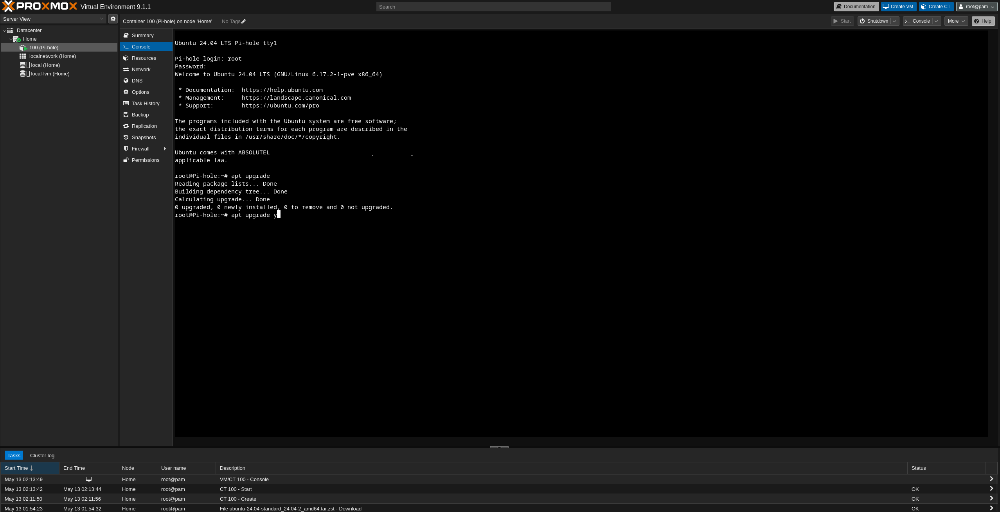

---

## 📸 Part 2: Installing pihole

### Step 4: Run the pihole One Line Installer

pihole provides an automated installer that handles everything including downloading dependencies, setting up the web server, configuring DNS, and creating the admin dashboard.

```bash
curl -sSL https://install.pi-hole.net | bash
```

This downloads the installer script from pihole's official servers and pipes it directly into bash to execute it. The `-sSL` flags tell curl to run silently, show errors if they occur, and follow any redirects.

### Step 5: Walk Through the Setup Wizard

**Static IP confirmation** — The installer first checks that the machine has a static IP. Since this was configured in Proxmox already, click Continue.

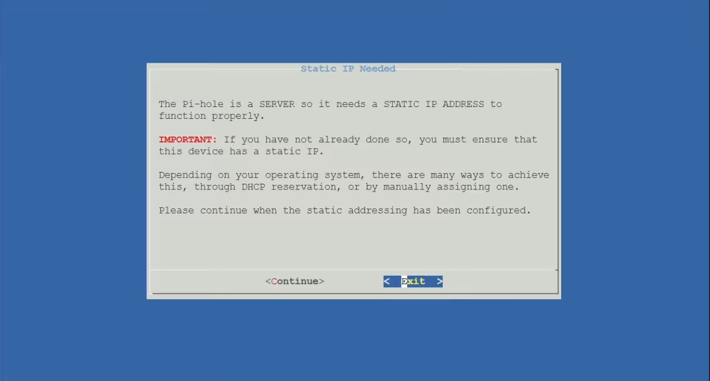

**Upstream DNS provider** — Select any option here. It does not matter because this entire setting will be replaced with Unbound in Part 4. Google is selected as a temporary placeholder.

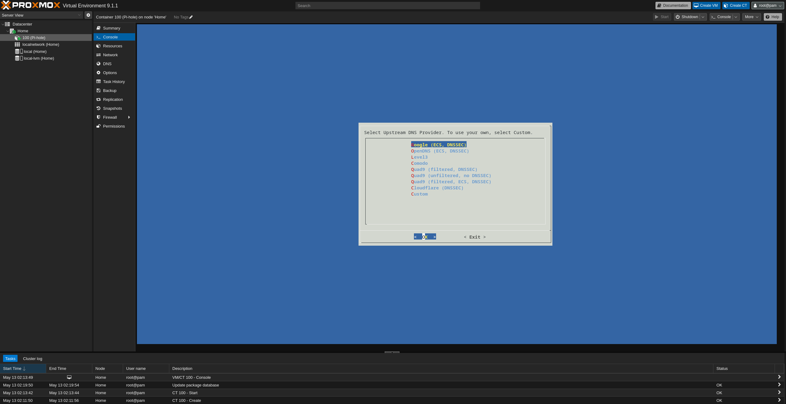

**Blocklists** — pihole blocks ads by checking requested domains against a list of known ad servers. The installer offers StevenBlack's Unified Hosts List, a well maintained community blocklist covering ads, malware, and trackers. Select Yes to include it.

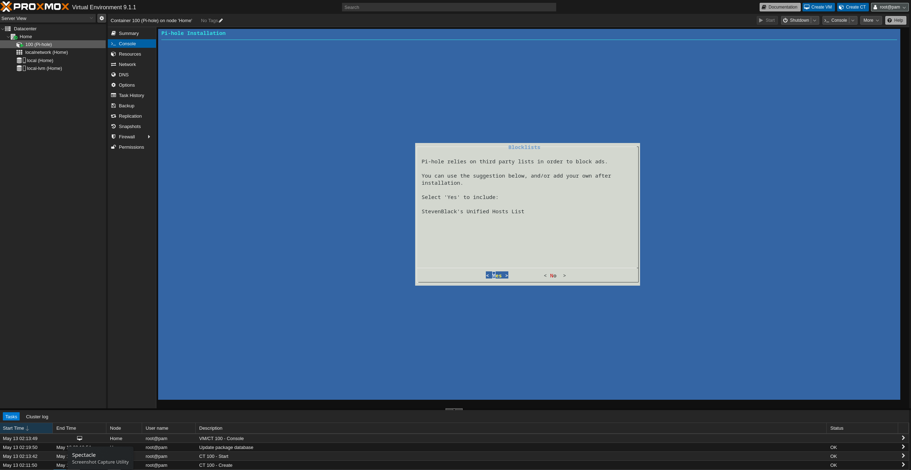

**Query logging** — Enabling this records every DNS request that passes through pihole. This is extremely useful for seeing which devices are making requests, identifying blocked domains, and troubleshooting.


**Privacy mode** — Selecting Show everything gives full visibility into which domains are being requested and by which clients.

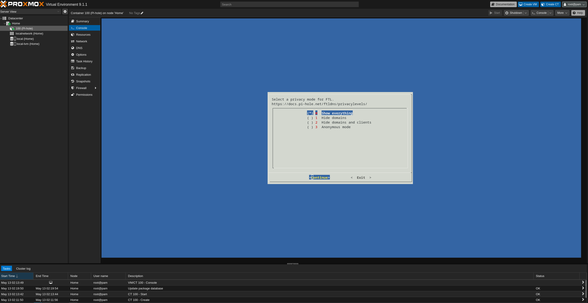

### Step 6: Installation Complete

When the installer finishes it displays a completion screen showing your pihole's IP address and a randomly generated admin panel password.

> ⚠️ **Save the admin password shown on this screen before clicking OK.** It is only shown once. If you lose it you can reset it with `pihole setpassword` in the terminal, but you will need console access to do so.

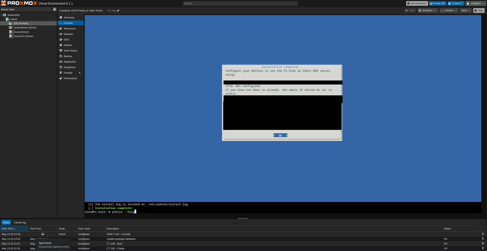

---

## 📸 Part 3: Configuring pihole

### Step 7: Set a Custom Admin Password

The auto generated password is random and hard to remember. Set a new one with:

```bash
pihole setpassword
```

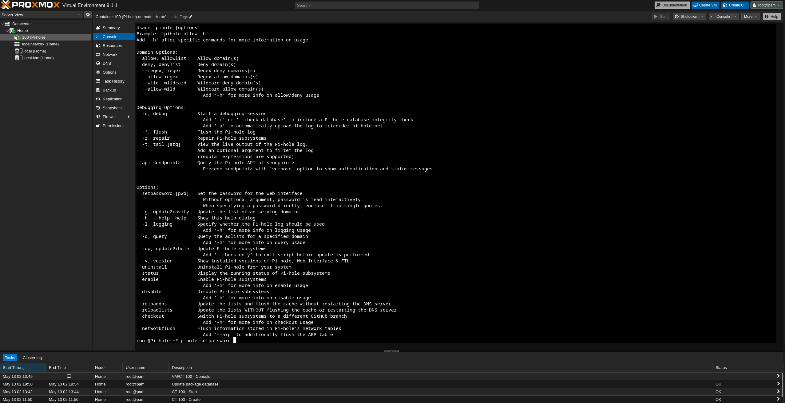

### Step 8: Access the pihole Admin Dashboard

Open a web browser on any device connected to the same network and navigate to your pihole's admin page:

```
http://YOUR-PIHOLE-IP/admin
```

> 🔒 **Example only:** `http://192.168.1.XXX/admin` — replace `XXX` with your actual static IP. Your pihole IP is the static IP you assigned to the container in Proxmox during Step 2. Every setup will have a different IP depending on your home network. To find yours, check the Summary tab of your LXC container in Proxmox under the IPs section. Log in with the password you just set.

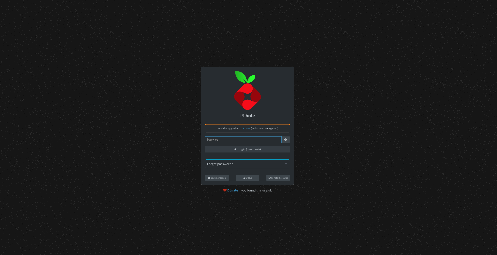
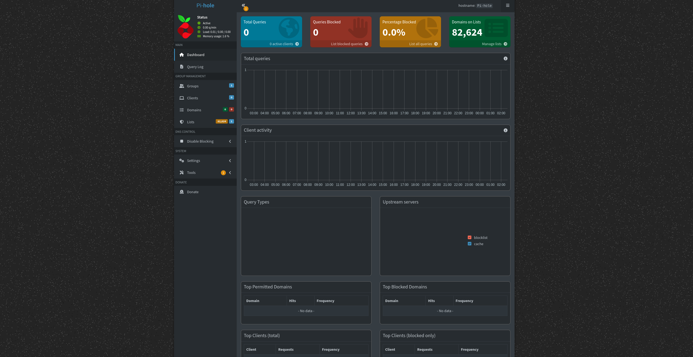

### Step 9: Add Extra Blocklists

pihole's blocking power comes entirely from its blocklists, the larger and more comprehensive they are, the more ads and trackers get blocked. The Firebog is a curated directory of high quality blocklists organized by category. Lists marked with a green checkmark are the safest to add without causing false positives.

To add a list go to **Group Management → Lists**, paste the URL from Firebog into the Address field, and click Add Blocklist.

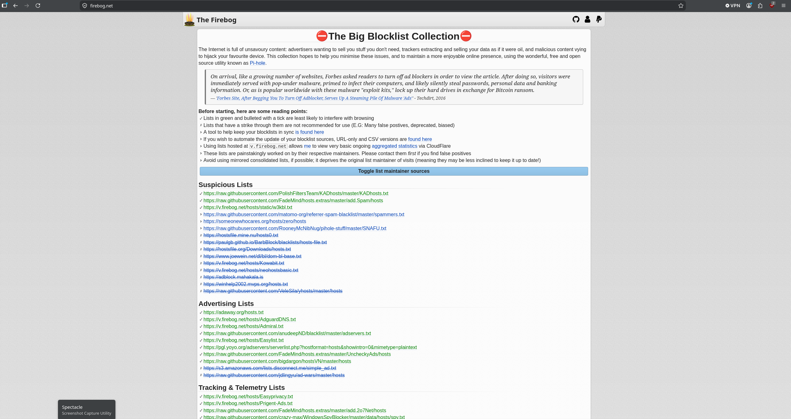
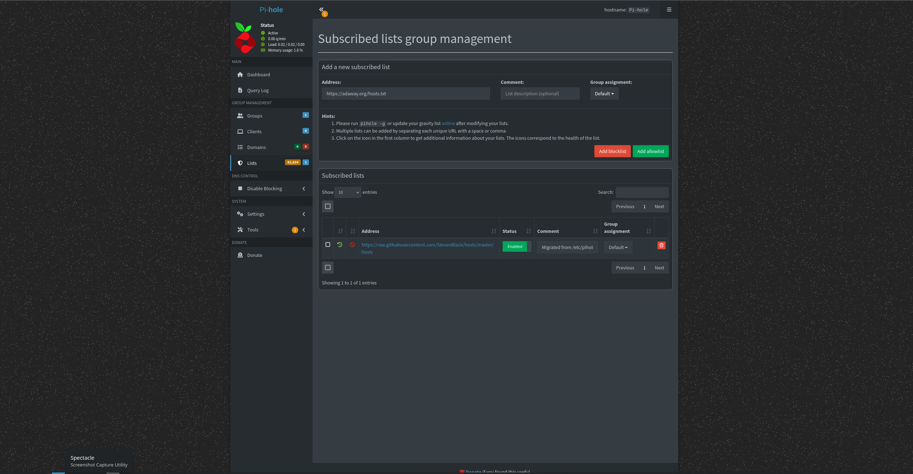
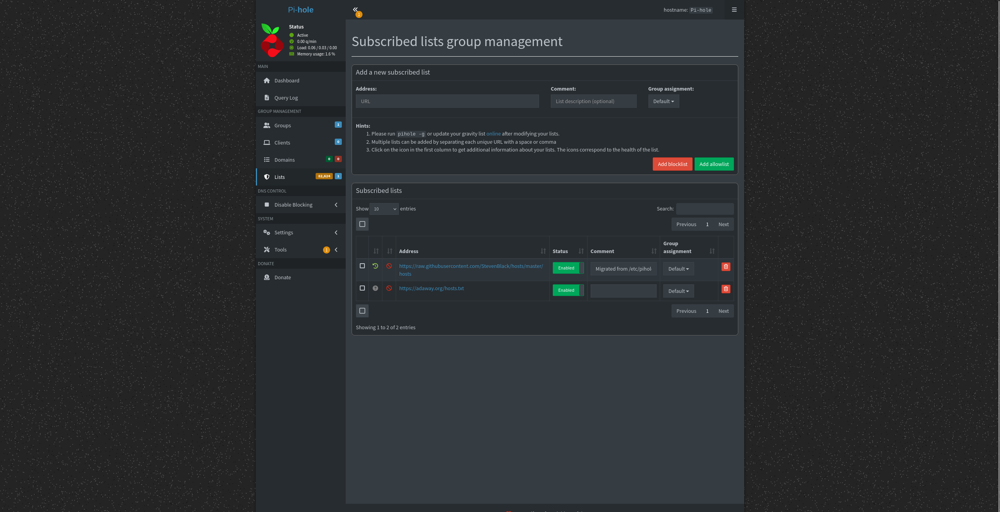

### Step 10: Update Gravity

After adding new blocklists, pihole needs to rebuild its internal database called Gravity to include the new entries. Go to **Tools → Update Gravity** and click Update.

Gravity is the compiled database of all domains pihole will block. Every time you add or remove a blocklist you need to update Gravity to apply the changes. The process pulls the latest entries from every subscribed list and merges them into a single optimized database.

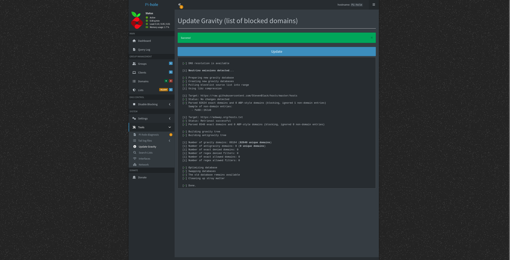

---

## 📸 Part 4: Installing and Configuring Unbound

### Step 11: Install Unbound

```bash
apt install unbound -y
```

Unbound is a recursive DNS resolver. When pihole receives a non blocked DNS query, instead of forwarding it to Google or Cloudflare it will send it to Unbound. Unbound then contacts the internet's root DNS servers directly to resolve the query, meaning no third party ever sees what you are looking up.

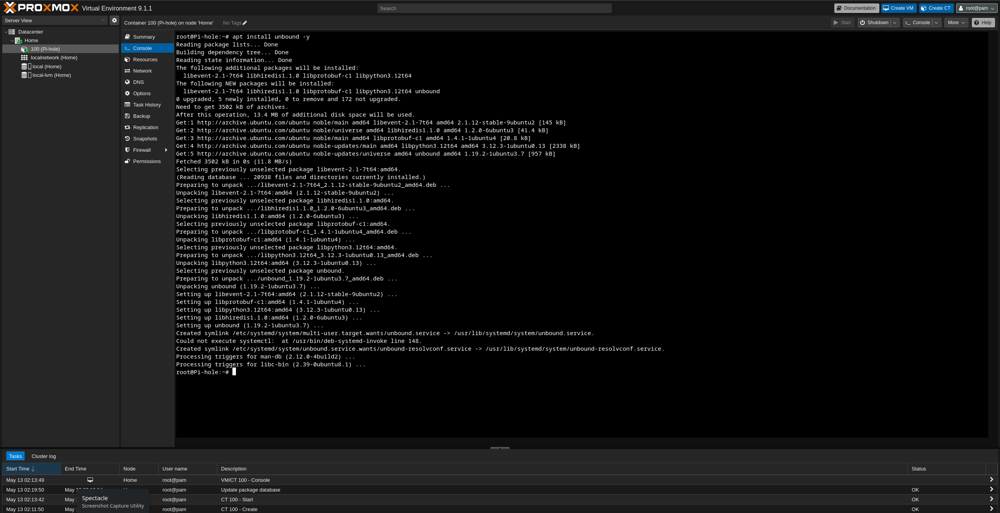

### Step 12: Reference the Official Unbound Configuration

The official pihole documentation provides a recommended Unbound configuration specifically tuned for use alongside pihole. This was used as the source for the config file created in the next step.

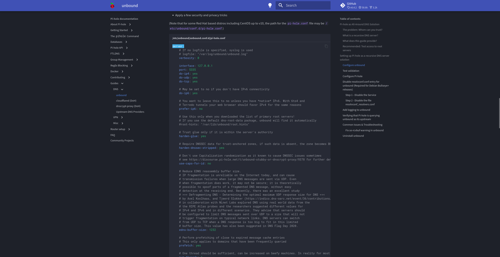

### Step 13: Create the Unbound Configuration File

```bash
sudo nano /etc/unbound/unbound.conf.d/pi-hole.conf
```

This file tells Unbound how to behave, which port to listen on, what security settings to apply, and which private IP ranges to protect. By placing it in the `unbound.conf.d/` directory rather than editing the main config file, the changes stay organized and easy to manage.

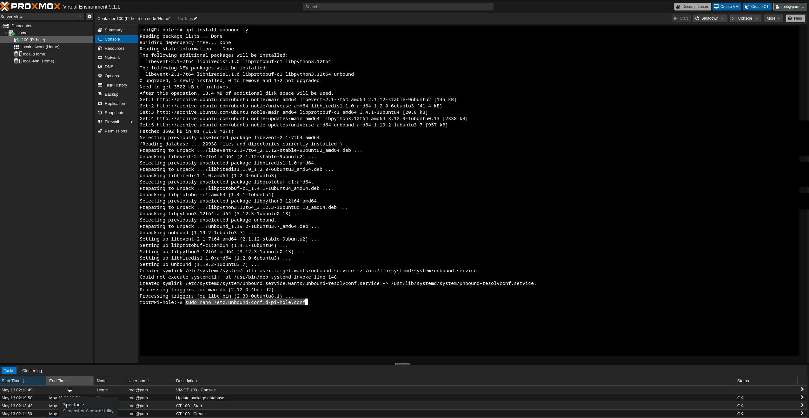

Paste in the following configuration:

```conf
server:
    verbosity: 0
    interface: 127.0.0.1
    port: 5335
    do-ip4: yes
    do-udp: yes
    do-tcp: yes
    do-ip6: yes
    prefer-ip6: no
    harden-glue: yes
    harden-dnssec-stripped: yes
    use-caps-for-id: no
    edns-buffer-size: 1232
    prefetch: yes
    num-threads: 1
    so-rcvbuf: 1m
    private-address: 192.168.0.0/16
    private-address: 169.254.0.0/16
    private-address: 172.16.0.0/12
    private-address: 10.0.0.0/8
    private-address: fd00::/8
    private-address: fe80::/10
```

Key settings explained:
- `interface: 127.0.0.1` — Unbound only listens on localhost so only pihole (on the same machine) can talk to it
- `port: 5335` — Unbound listens on port 5335 instead of the default port 53, which pihole already uses
- `harden-glue` and `harden-dnssec-stripped` — Security settings that prevent DNS spoofing and stripping attacks
- `prefetch: yes` — Unbound pre fetches frequently visited domains before their cache expires, making lookups faster
- `private-address` — Blocks responses pointing to private IP ranges, preventing DNS rebinding attacks

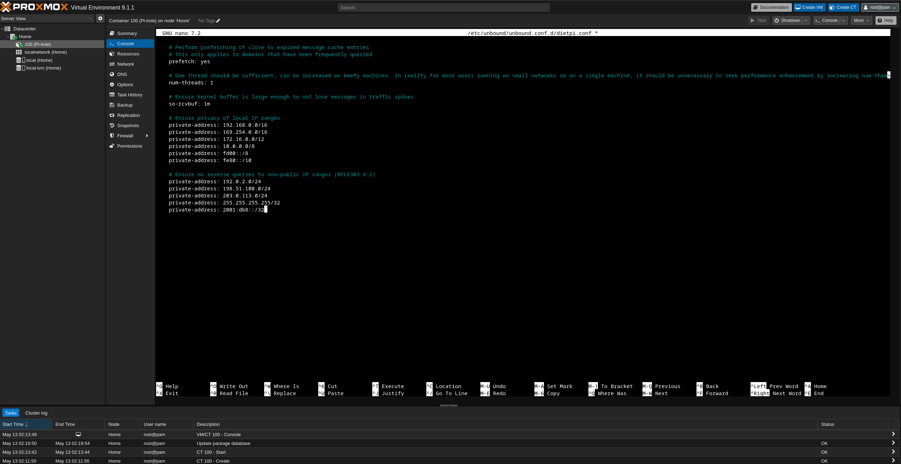

Save and close with `Ctrl+X`, then `Y`, then `Enter`.

### Step 14: Start and Enable Unbound

```bash
systemctl restart unbound
systemctl enable unbound
```

`systemctl restart` starts Unbound immediately using the new config. `systemctl enable` registers it to start automatically every time the container boots, so even after a reboot or power outage, the entire stack comes back online on its own.


---

## 📸 Part 5: Connecting pihole to Unbound

### Step 15: Point pihole at Unbound as Its Upstream DNS

pihole still thinks its upstream DNS is Google from the installer wizard. In the pihole admin panel go to **Settings → DNS**. Uncheck every upstream DNS provider listed, then scroll to the Custom DNS servers section and enter:

```
127.0.0.1#5335
```

This tells pihole: for any DNS request that is not blocked, forward it to the service running on this same machine at port 5335, which is Unbound. Click **Save and Apply**.

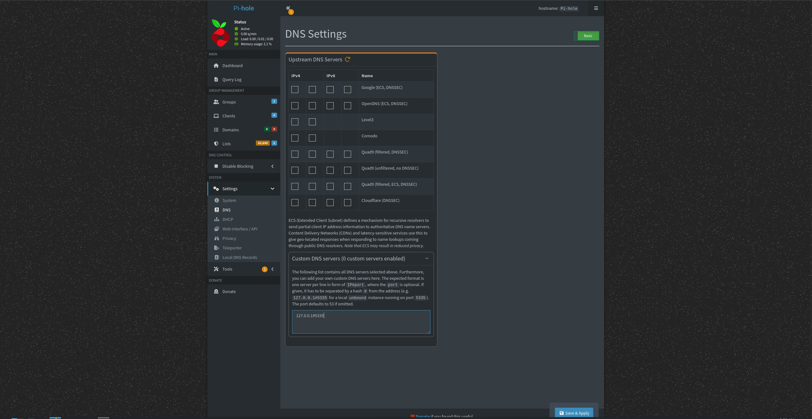

---

## 📸 Part 6: Pointing the Router to pihole

### Step 16: Update the Router DNS Settings

pihole is now fully set up and running, but no devices on the network are using it yet. To make pihole the DNS server for every device on the network without configuring each device individually, the router's DNS setting needs to be updated.

Log in to your router's admin panel and find the DNS or Internet Setup section. Set the **Primary DNS** to the static IP address of your pihole container. Save and apply the change.

Once saved, every device that connects to the network will automatically route its DNS traffic through pihole, phones, laptops, smart TVs, gaming consoles, without any individual device configuration required.

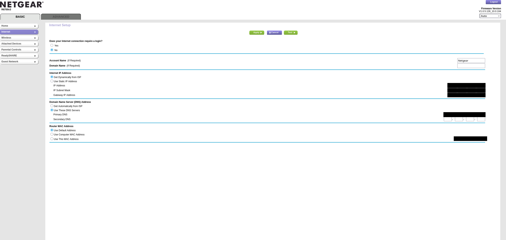

> 🔒 **Note:** The IP address visible in the screenshot above has been redacted for privacy. Your pihole's static IP will differ based on your home network configuration.

---

## 📸 Part 7: Verifying Everything Works

### Step 17: Run a dig Test

The `dig` command is a DNS lookup tool that lets you manually query a DNS server and inspect the full response. Running it confirms the entire chain is working end to end.

```bash
dig google.com @YOUR-PIHOLE-IP
```

> 🔒 **Example only:** `dig google.com @192.168.1.XXX` — replace with your actual pihole static IP.

A successful response shows `status: NOERROR` and a valid IP address in the ANSWER SECTION. The SERVER line confirms which DNS server answered the query.

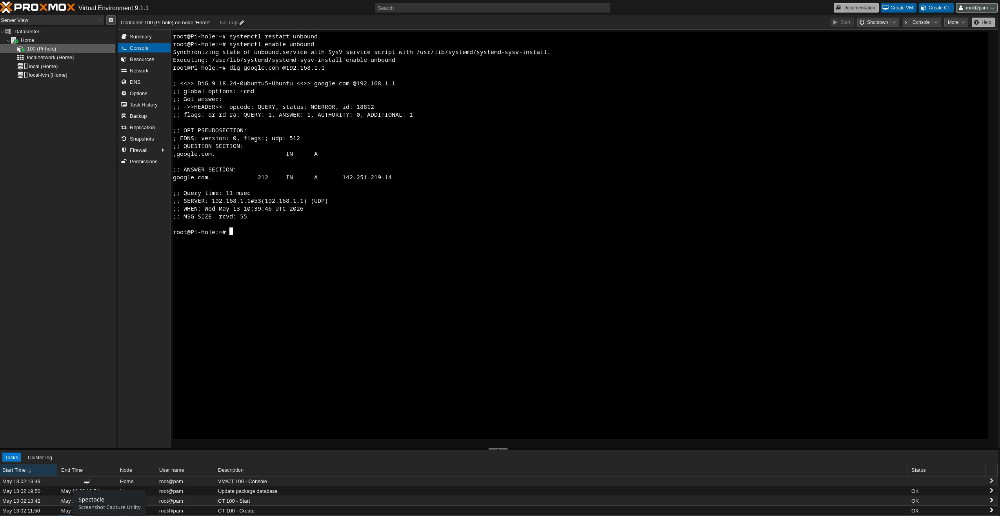

### Step 18: Confirm pihole Dashboard Shows Active Traffic

Check the pihole dashboard. Within a few minutes of updating the router DNS, queries from devices on the network will start appearing. The Upstream servers panel should show `localhost#5335` confirming pihole is forwarding non blocked queries to Unbound rather than any external provider.

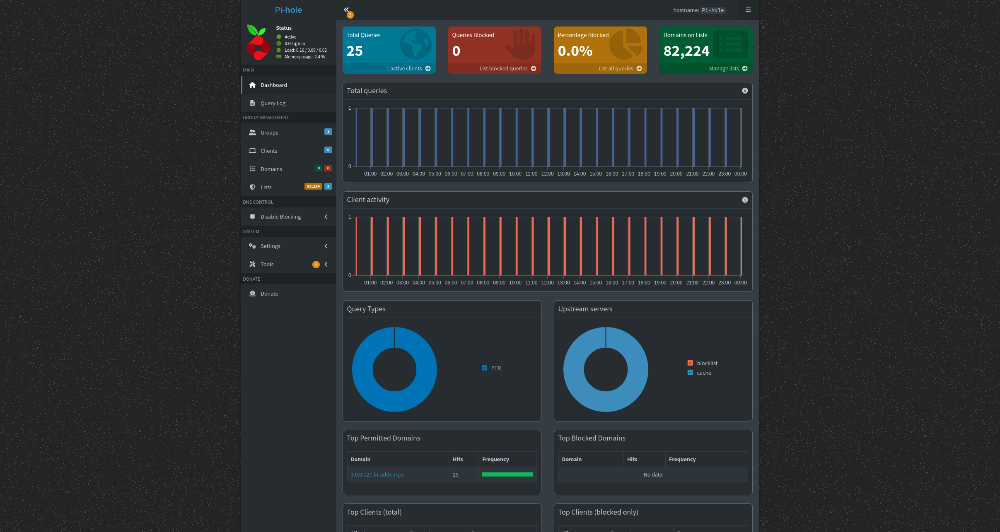

---

## 🧪 Testing and Validation

| Test | Command or Action | Expected Result |
|---|---|---|
| Unbound resolving directly | `dig google.com @127.0.0.1 -p 5335` | NOERROR with IP in answer section |
| DNSSEC validation active | `dig fail01.dnssec.works @127.0.0.1 -p 5335` | SERVFAIL — correct, means DNSSEC is working |
| pihole blocking ads | Visit any ad heavy website | Ads fail to load across the whole network |
| Dashboard showing traffic | pihole admin → Dashboard | Query count incrementing, upstream shows `localhost#5335` |
| Ad block effectiveness | [d3ward.github.io/toolz/adblock](https://d3ward.github.io/toolz/adblock) | High block percentage score |

---

## 🔧 Troubleshooting

**Unbound fails to start**
```bash
sudo unbound-checkconf /etc/unbound/unbound.conf.d/pi-hole.conf
```

**pihole dashboard not loading**
```bash
systemctl status pihole-FTL
systemctl restart pihole-FTL
```

**Devices still seeing ads after changing router DNS**
- Restart devices to flush their old DNS cache
- Disable DNS over HTTPS in browser settings. Chrome and Firefox have this enabled by default and it bypasses pihole
- Confirm the router saved the DNS change by logging back in and checking

**pihole dashboard shows no queries**
```bash
nslookup google.com
```
The Server field in the response should show your pihole's IP address. If it shows something else, the router DNS change has not taken effect yet.

> 🔒 **Note:** All IP addresses shown in commands and examples above are placeholders. Replace them with your actual network configuration.

---

## 📚 Resources

- [Proxmox VE Documentation](https://pve.proxmox.com/wiki/Main_Page)
- [pihole Official Documentation](https://docs.pi-hole.net/)
- [pihole and Unbound Setup Guide](https://docs.pi-hole.net/guides/dns/unbound/)
- [Unbound Official Documentation](https://nlnetlabs.nl/documentation/unbound/)
- [The Firebog — Blocklist Collection](https://firebog.net/)
- [Ad Block Effectiveness Tester](https://d3ward.github.io/toolz/adblock)

---

<div align="center">
  <p>Built with ❤️ as a home lab project | Documentation by <a href="https://github.com/wholean">@wholean</a></p>
</div>
